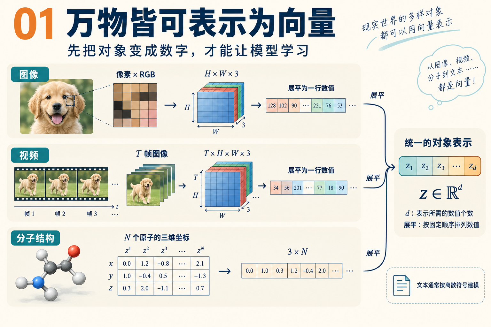
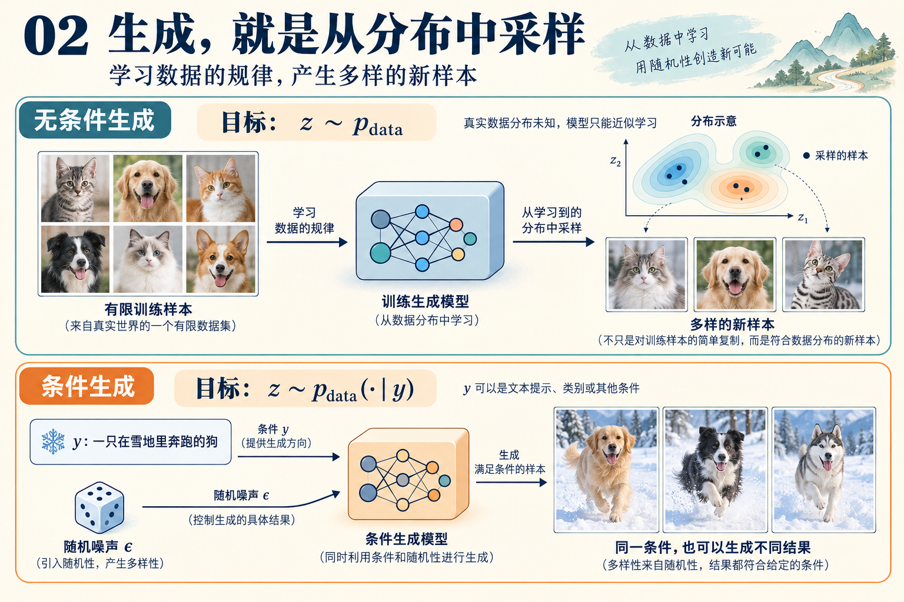

# 生成建模：对象、分布与采样

生成建模的目标，是利用已有数据，学习产生新样本的规律。图像、视频和分子结构虽然形式不同，但都可以先表示为数字，再用概率分布描述它们的变化与多样性。

本篇围绕一个问题展开：**有限的数据，如何帮助我们构建一个能够产生新样本的随机机制？**

记号约定：$Z$ 表示随机变量，$z$ 表示具体样本；$P$ 表示概率分布，$p$ 表示分布具有密度时的概率密度函数。

## 1. 用向量表示数据

一张 RGB 图像可以表示为：

$$
z\in\mathbb R^{H\times W\times3}.
$$

其中 $H,W$ 分别是图像的高度与宽度，三个通道对应红、绿、蓝。

如果视频包含 $T$ 帧，则：

$$
z\in\mathbb R^{T\times H\times W\times3}.
$$

包含 $N$ 个原子的分子，其空间坐标可以表示为：

$$
z=(z^1,\ldots,z^N)\in\mathbb R^{3\times N},
\qquad z^i\in\mathbb R^3.
$$

这里的上标 $i$ 是原子编号。完整的分子表示还可能包含原子类型、化学键等信息。

按固定顺序将这些数值展平，就得到统一的表示：

$$
\boxed{z\in\mathbb R^d.}
$$

对应的维数分别为：

$$
d_{\text{图像}}=3HW,\qquad
d_{\text{视频}}=3THW,\qquad
d_{\text{坐标}}=3N.
$$

### 展平与维数

以图像为例，固定排列顺序后，可以定义变换：

$$
T:\mathbb R^{H\times W\times3}\longrightarrow\mathbb R^{3HW}.
$$

只要保留形状和排列顺序，就可以还原原来的数组：

$$
T^{-1}(T(z))=z.
$$

因此，展平只是重新排列数值，本身不丢失信息。它让我们能够在统一的样本空间上讨论概率分布。

需要区分两个概念：

- **表示维数**：记录一个对象用了多少个数值。
- **内在自由度**：对象实际上能够独立变化的因素有多少。

一张图像虽然可能包含数百万个像素值，但这些数值之间通常存在很强的关联。向量表示也不意味着所有数据都必须采用连续概率模型；像素可以是量化值，文本通常按离散符号建模。这里主要讨论连续数据的数学描述。

## 2. 用概率分布描述多样性

同一个类别可以包含许多不同的样本。例如，狗的图像可以具有不同的品种、姿态、背景和光照。

用真实数据分布 $P_{\mathrm{data}}$ 描述这些变化，生成任务可以写成：

$$
\boxed{Z\sim P_{\mathrm{data}}.}
$$

符号 $\sim$ 表示“服从某个分布”，也可以从操作角度理解为“从这个分布中采样”。

当数据分布存在密度时：

$$
p_{\mathrm{data}}:\mathbb R^d\rightarrow\mathbb R_{\ge0},
$$

并满足：

$$
p_{\mathrm{data}}(z)\ge0,
\qquad
\int_{\mathbb R^d}p_{\mathrm{data}}(z)\,\mathrm dz=1.
$$

### 概率密度与概率

对于样本空间中的一个可测区域 $A$，有：

$$
\boxed{
\Pr(Z\in A)
=
\int_Ap_{\mathrm{data}}(z)\,\mathrm dz.
}
$$

例如，$A$ 可以表示所有“雪地中的狗”的图像构成的集合。

密度描述单位体积附近的概率集中程度。在密度连续的位置，对于足够小的区域 $B$：

$$
\Pr(Z\in B)
\approx
p_{\mathrm{data}}(z)\operatorname{Vol}(B),
\qquad z\in B.
$$

因此，$p_{\mathrm{data}}(z)$ 本身不是恰好生成样本 $z$ 的概率。对于具有密度的连续分布：

$$
\Pr(Z=z)=0.
$$

密度可以大于 $1$，但它在整个空间上的积分必须等于 $1$。

### 为什么最高密度点不能代表整个分布？

考虑标准高斯分布：

$$
Z\sim\mathcal N(0,I_d).
$$

它在 $z=0$ 处的密度最大。如果一个生成器始终输出 $0$，其输出分布就是：

$$
P_{\mathrm{gen}}=\delta_0,
$$

其中 $\delta_0$ 表示全部概率集中在原点。

虽然输出位于高斯分布的最高密度处，但它缺少高斯分布的变化。比较二阶矩即可看出：

$$
\mathbb E\|Z\|^2
=
\sum_{j=1}^{d}\mathbb E[Z_j^2]
=d,
$$

而始终输出 $0$ 时：

$$
\mathbb E\|\widehat Z\|^2=0.
$$

生成模型需要复现不同结果的出现频率、多样性以及变量之间的关系。一个看起来合理的样本，无法独自说明生成分布是否正确。

## 3. 从有限数据认识未知分布

真实分布通常未知。实际能够获得的是一个有限数据集：

$$
\mathcal D=\{z_1,\ldots,z_N\}.
$$

常见假设是：

$$
\boxed{
Z_1,\ldots,Z_N
\overset{\mathrm{i.i.d.}}{\sim}
P_{\mathrm{data}}.
}
$$

其中 i.i.d. 表示独立同分布。下标 $i$ 标记第 $i$ 个数据样本，此处的 $N$ 是样本数量。

### 经验分布

给定观察到的数据，可以定义经验分布：

$$
\boxed{
\widehat P_N
=
\frac1N\sum_{i=1}^{N}\delta_{z_i}.
}
$$

它相当于给每个观测样本分配 $1/N$ 的概率。因此：

$$
\widehat P_N(A)
=
\frac1N\sum_{i=1}^{N}
\mathbf1_{\{z_i\in A\}},
$$

也就是数据集中落入区域 $A$ 的样本比例。符号 $\mathbf1$ 是指示函数：条件成立时为 $1$，否则为 $0$。

对于一个统计量 $f$，经验分布下的期望为：

$$
\boxed{
\mathbb E_{\widehat P_N}[f(Z)]
=
\frac1N\sum_{i=1}^{N}f(z_i).
}
$$

例如，$f$ 可以表示图像平均亮度，也可以是“图像中是否包含狗”的指示函数。

### 经验平均为什么有效？

对于预先固定、满足 $\mathbb E|f(Z)|<\infty$ 的统计量，大数定律给出：

$$
\boxed{
\frac1N\sum_{i=1}^{N}f(Z_i)
\xrightarrow[N\to\infty]{\mathrm{a.s.}}
\mathbb E_{P_{\mathrm{data}}}[f(Z)].
}
$$

其中 a.s. 表示几乎必然收敛。

如果进一步有：

$$
\operatorname{Var}(f(Z))=\sigma_f^2<\infty,
$$

利用样本独立性可得：

$$
\begin{aligned}
\operatorname{Var}
\left(\frac1N\sum_{i=1}^{N}f(Z_i)\right)
&=
\frac1{N^2}
\sum_{i=1}^{N}\operatorname{Var}(f(Z_i))\\
&=
\boxed{\frac{\sigma_f^2}{N}}.
\end{aligned}
$$

因此，这个固定统计量的估计标准差为：

$$
\frac{\sigma_f}{\sqrt N}.
$$

数据量增加，使我们能够更准确地估计总体的统计规律。不过，这并不直接意味着整个生成模型的误差也按 $N^{-1/2}$ 下降；看过数据后再选择统计量，也需要额外分析。

### 经验分布与真实分布的区别

经验分布把概率集中在有限个训练样本上，而真实分布可能覆盖更广泛的空间。

如果真实分布没有点质量，令：

$$
S_N=\{z_1,\ldots,z_N\},
$$

则：

$$
\widehat P_N(S_N)=1,
\qquad
P_{\mathrm{data}}(S_N)=0.
$$

所以，“数据越来越能代表真实分布”需要具体说明比较方式。固定统计量的经验平均可以收敛，但不能据此认为经验分布在所有意义下都接近真实分布。这里 $S_N$ 还随数据与样本数变化，并非大数定律中的预先固定区域。

## 4. 生成器如何产生一个分布

生成过程可以抽象为：

$$
\boxed{
\varepsilon\sim P_{\mathrm{init}},
\qquad
\widehat Z=G_\theta(\varepsilon).
}
$$

其中：

- $\varepsilon$ 是随机输入。
- $P_{\mathrm{init}}$ 是容易采样的分布。
- $G_\theta$ 是参数为 $\theta$ 的生成器。
- $\widehat Z$ 是生成结果。

即使 $G_\theta$ 是确定性函数，只要输入 $\varepsilon$ 是随机的，输出就可以具有多样性。

### 从函数到输出分布

对于任意可测区域 $A$：

$$
\begin{aligned}
P_\theta(A)
&=\Pr(\widehat Z\in A)\\
&=\Pr(G_\theta(\varepsilon)\in A)\\
&=\int
\mathbf1_A(G_\theta(e))\,
P_{\mathrm{init}}(\mathrm de).
\end{aligned}
$$

这个输出分布称为推前分布：

$$
\boxed{
P_\theta=(G_\theta)_\#P_{\mathrm{init}}.
}
$$

它描述随机输入经过 $G_\theta$ 变换后，概率如何重新分布。只要 $G_\theta$ 可测，这个定义就成立；不要求它可逆，也不要求能够计算输出的概率密度。

### 分布匹配的统计含义

对于适当的统计量 $f$：

$$
\boxed{
\mathbb E_{\widehat Z\sim P_\theta}[f(\widehat Z)]
=
\mathbb E_{\varepsilon\sim P_{\mathrm{init}}}
[f(G_\theta(\varepsilon))].
}
$$

理想目标是：

$$
P_\theta=P_{\mathrm{data}}.
$$

它等价于：

$$
\boxed{
\mathbb E_\varepsilon[f(G_\theta(\varepsilon))]
=
\mathbb E_{P_{\mathrm{data}}}[f(Z)]
\quad
\text{对所有有界可测 }f.
}
$$

这个等价关系的反方向很直接：取 $f=\mathbf1_A$，就得到两个分布对每个区域 $A$ 都赋予相同的概率。

有限训练数据只能提供真实期望的估计：

$$
\mathbb E_{P_{\mathrm{data}}}[f(Z)]
\approx
\frac1N\sum_{i=1}^{N}f(z_i).
$$

这是对学习目标的刻画，尚未指定具体的训练损失或算法。

### 记忆训练集与泛化

如果生成器只是均匀抽取训练样本：

$$
I\sim\operatorname{Uniform}\{1,\ldots,N\},
\qquad
\widehat Z=z_I,
$$

那么：

$$
P_\theta=\widehat P_N.
$$

这是一个合法的采样器，但它只重现经验分布。能否产生符合总体规律的新样本，还涉及模型的泛化能力。

[查看训练与生成示意图](../assets/images/intro-03.png)

*这张图的下半部分涉及后续的 ODE、SDE 主题；当前先关注训练数据、随机输入与生成结果之间的关系。*

## 5. 条件生成：学习对象与条件的关系

引入条件变量 $Y$ 后，目标变为：

$$
\boxed{
Z\sim P_{\mathrm{data}}(\cdot\mid Y=y).
}
$$

条件 $y$ 可以是文本提示、类别或其他信息。例如：

$$
y=\text{“一只在雪地里奔跑的狗”}.
$$

其中圆点表示“关于生成对象的整个分布”。生成器相应地写成：

$$
\boxed{
\widehat Z=G_\theta(\varepsilon,y).
}
$$

通常从与条件独立的固定随机源中抽取 $\varepsilon$。固定条件 $y$，改变随机输入 $\varepsilon$，仍然可以得到不同的合理样本。

### 条件分布与联合分布

训练数据一般由配对样本组成：

$$
\mathcal D=\{(z_i,y_i)\}_{i=1}^{N}.
$$

当相关密度或概率质量函数存在，且 $p_{\mathrm{data}}(y)>0$ 时：

$$
\boxed{
p_{\mathrm{data}}(z\mid y)
=
\frac{p_{\mathrm{data}}(z,y)}
     {p_{\mathrm{data}}(y)}
=
\frac{
p_{\mathrm{data}}(y\mid z)\,
p_{\mathrm{data}}(z)
}{
p_{\mathrm{data}}(y)
}.
}
$$

条件生成因此需要学习 $Z$ 与 $Y$ 的对应关系。

无条件分布则是各条件分布按条件出现频率形成的混合：

$$
\boxed{
P_{\mathrm{data}}(Z\in A)
=
\int
P_{\mathrm{data}}(Z\in A\mid Y=y)\,
P_{\mathrm{data}}^Y(\mathrm dy).
}
$$

这里 $P_{\mathrm{data}}^Y$ 是条件变量 $Y$ 的边际分布。若 $Y$ 取离散值，积分可写成对各条件的加权求和。

### 边际分布正确，不保证条件关系正确

用 $0$ 表示猫、$1$ 表示狗。设：

$$
Y\sim\operatorname{Bernoulli}(1/2),
\qquad
Z_{\mathrm{data}}=Y.
$$

真实数据中，猫提示对应猫，狗提示对应狗。

如果生成器把条件全部反过来：

$$
\widehat Z=1-Y,
$$

则：

$$
Z_{\mathrm{data}}
\sim\operatorname{Bernoulli}(1/2),
\qquad
\widehat Z
\sim\operatorname{Bernoulli}(1/2).
$$

两者都生成一半猫、一半狗，无条件分布完全相同。但：

$$
\Pr(Z_{\mathrm{data}}=Y)=1,
\qquad
\Pr(\widehat Z=Y)=0.
$$

这说明条件生成需要满足更具体的目标：

$$
\boxed{
P_\theta(\cdot\mid y)
\approx
P_{\mathrm{data}}(\cdot\mid y).
}
$$

除了样本本身合理，还需要在给定条件下，生成正确的类别、属性与变化范围。

## 复习问题

- 为什么概率密度可以大于 $1$，却不能直接理解为样本出现的概率？
- 为什么始终生成最高密度点不能实现正确采样？
- 经验平均的误差按 $N^{-1/2}$ 缩小，需要哪些假设？这个结论为什么不能直接用于整个生成模型？
- 一个无法计算输出密度的生成器，是否仍然定义了概率分布？
- 为什么正确的无条件分布不能保证正确的条件生成？

## 待解决的问题

- [ ] 如何选择衡量两个分布接近程度的方法？
- [ ] 如何根据有限样本设计可优化的训练目标？
- [ ] 如何把易于采样的随机输入逐步转换为具有数据结构的样本？

## 参考资料

- `lecture_notes.pdf`，第 1 章 Introduction，PDF 第 3–6 页。
- 经验分布、大数定律、推前分布及两个反例作为概念理解的数学展开。
