# 2.1 Flow Models 逐步白板推导

这一节要解决的问题是：怎样用一个微分方程定义生成模型，并在计算机上运行它？先理解一个确定的点怎样运动，最后再把起点设为随机样本。这样，运动、数值求解和生成之间的关系就能逐步接起来。

以下覆盖原文 PDF 第 7–9 页的 2.1 节，保持原有叙述顺序和主要标题：**Trajectory → Vector field → ODE → Flow → Theorem 3 → Example 4 → Simulating an ODE → Flow models → Algorithm 1**。贯穿计算的例子是 $u_t(x)=-x$，每次只增加一个新概念；Diffusion Models 暂不展开。

[下载十五张白板 PDF](../assets/images/flow-models-walkthrough/flow-models-walkthrough.pdf ':ignore') · [下载高清图片与矢量图](../assets/images/flow-models-walkthrough/flow-models-walkthrough.zip ':ignore')

## Trajectory 轨迹

### 先明确状态 x 表示什么

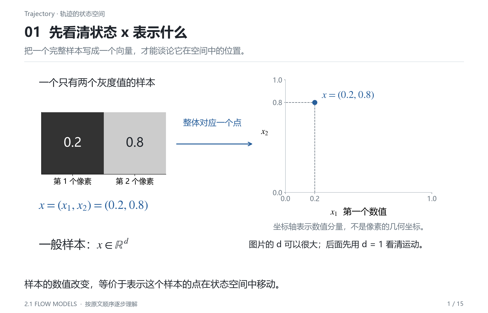

先看图中的两个像素。假设一张极小的灰度图片只有两个像素，它们的亮度分别是 $x_1$ 和 $x_2$。整张图片就可以写成一个向量：

$$
x=\begin{pmatrix}x_1\\x_2\end{pmatrix}\in\mathbb R^2.
$$

当亮度改变时，向量的坐标改变，在二维状态空间里表现为一个点的移动。因此，图中的一个点代表整张图片，两个坐标分别代表图片的两个数值。这个点所在的坐标平面不是图片的画布。

真实图片可能有很多像素和颜色通道，状态的维度 $d$ 就会很大；也可以先把图片编码成潜在向量，再让这个向量运动。二维图只是把状态变化画得出来，数学表达统一写成 $x\in\mathbb R^d$。

在理解运动规律时，先用一维状态 $x\in\mathbb R$ 会更容易。这时状态只用一个数表示，可以直接画出“时间—状态”曲线。这里暂时不限制状态必须是像素亮度范围，一维例子的目的只是看清方程怎样工作。

### 从一个状态到一整条轨迹

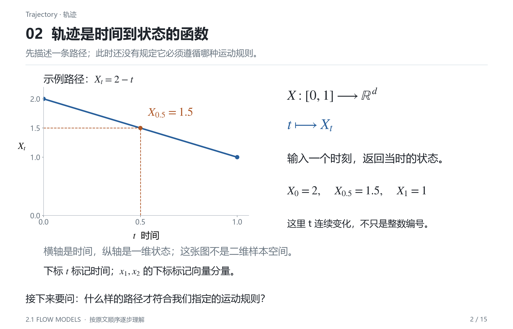

一条轨迹是一个函数：

$$
X:[0,1]\longrightarrow\mathbb R^d,
\qquad t\longmapsto X_t.
$$

逐项读这个定义：$[0,1]$ 是时间范围；输入一个时间 $t$，输出该时刻的状态 $X_t$。记号 $X_t$ 和 $X(t)$ 的意思相同，下标 $t$ 在这里表示时间。

这个时间用于标记一次生成过程的进度，可以把 $0$ 理解为开始、$1$ 理解为结束。它不必对应现实世界的一秒，也不要求最终生成的是视频。即使输出是一张静态图片，构造它的过程仍然可以用这样的时间变量描述。

例如，先随意选一条一维候选轨迹：

$$
X_t=2-t.
$$

当 $t=0$，状态是 $2$；当 $t=0.5$，状态是 $1.5$；当 $t=1$，状态是 $1$。图中横轴是时间，纵轴是状态。沿曲线从左向右读，就是状态随时间变化的过程。

它的时间导数为：

$$
\frac{\mathrm dX_t}{\mathrm dt}=-1.
$$

导数告诉我们状态变化有多快；在这个一维图里，它就是曲线的切线斜率。负号表示状态正在减小，绝对值 $1$ 表示每单位时间减少多少。

到这里，我们只定义了“怎样记录一段运动”，还没有规定这段运动必须遵守什么规则。任何足够光滑的时间函数都可以先作为候选轨迹。接下来需要引入一种规则，判断哪些候选轨迹是允许的。

## Vector field 向量场

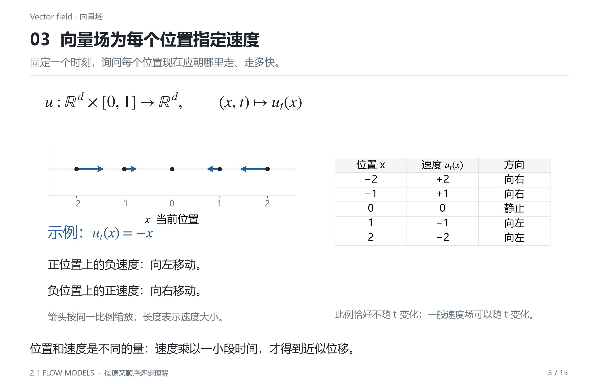

向量场为每一个时间、每一个位置指定速度：

$$
u:\mathbb R^d\times[0,1]\longrightarrow\mathbb R^d,
\qquad(x,t)\longmapsto u_t(x).
$$

这里有两个输入：当前位置 $x$ 和当前时间 $t$；输出 $u_t(x)$ 是一个速度向量。状态有 $d$ 个坐标，速度也有 $d$ 个分量，因为每个坐标都需要自己的变化速率。

以一维场为例：

$$
u_t(x)=-x.
$$

虽然记号仍带 $t$，这个特定例子的公式不显式依赖时间。同一个位置在不同时刻得到相同速度；一般的向量场可以随时间改变。

| 当前位置 $x$ | 指定速度 $u_t(x)$ | 怎样移动 |
| --- | ---: | --- |
| $-2$ | $2$ | 向右，速度较大 |
| $-1$ | $1$ | 向右，速度较小 |
| $0$ | $0$ | 此处速度为零 |
| $1$ | $-1$ | 向左，速度较小 |
| $2$ | $-2$ | 向左，速度较大 |

图中的箭头都朝向原点，离原点越远，箭头越长。箭头的长度表示速度大小；它没有直接给出“下一时刻的位置”。要从速度得到位移，还需要乘上经过的时间。

当时间间隔很小时：

$$
\text{位移}\approx\text{速度}\times\text{时间间隔},
\qquad \Delta x\approx u_t(x)\,\Delta t.
$$

轨迹描述“实际怎样走”，向量场规定“每到一个位置应该怎样走”。现在把这两者连接起来。

## ODE 常微分方程与初始条件

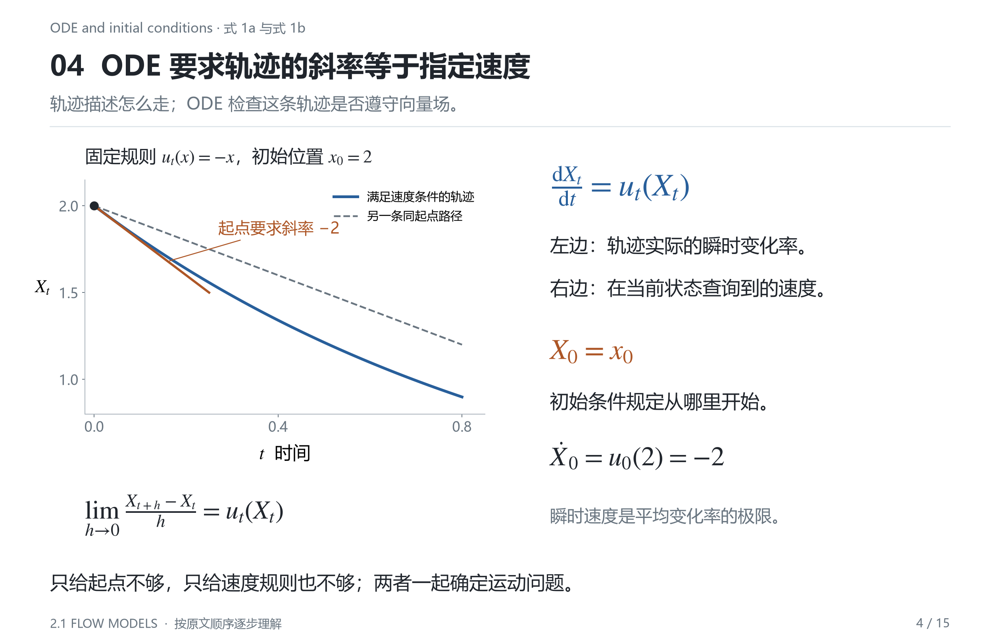

希望轨迹始终遵守向量场，就要求：

$$
\frac{\mathrm dX_t}{\mathrm dt}=u_t(X_t).
\tag{1a}
$$

左边是轨迹实际具有的瞬时速度，右边是向量场在当前状态 $X_t$ 处指定的速度。这个等式要求两者在每一时刻都相同。

判断一条轨迹是否合格时，可以先对候选函数求导，得到左边；再把这个函数的当前值代入速度场，得到右边；最后检查两边是否在整个时间区间相等。这样读方程，比只把它看作一串符号更容易操作。

右边必须代入 $X_t$，因为速度是根据当前位置查询的。点移动后，需要到新位置重新查询；始终使用起点 $x_0$ 会忽略位置变化。

还需要给出初始条件：

$$
X_0=x_0.
\tag{1b}
$$

$x_0$ 是给定的起点；$X_0$ 是轨迹在 $t=0$ 时的取值。这条等式要求轨迹从指定位置出发。向量场可以作用于很多起点，因此只给速度规则通常还不能选出一条具体轨迹。

继续取 $u_t(x)=-x$、$x_0=2$。在起点处，ODE 要求：

$$
\left.\frac{\mathrm dX_t}{\mathrm dt}\right|_{t=0}
=u_0(2)=-2.
$$

回看候选轨迹 $X_t=2-t$：它虽然满足 $X_0=2$，但起点斜率是 $-1$，所以不满足这个 ODE。**通过起点并不够，整条曲线的每一处速度也必须符合规定。**

当轨迹之后到达状态 $1$ 时，规定速度会变成 $-1$；到达状态 $0.5$ 时，规定速度变成 $-0.5$。速度的绝对值逐渐减小，因此我们已经能判断曲线不会一直沿起点切线下降。具体曲线的公式稍后再求。

“求解 ODE”就是寻找一个函数 $X_t$，同时满足速度条件和初始条件。它求的是整段时间上的状态变化，而不仅仅是某一个数。

## Flow 流映射

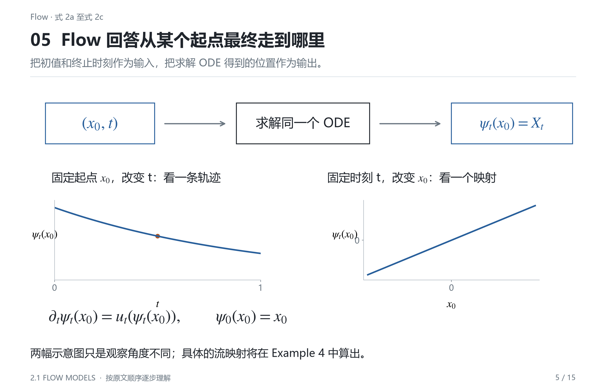

给定一个起点，可以求出一条轨迹。进一步的问题是：如果起点也允许变化，怎样统一记录所有起点的运动结果？

定义流映射：

$$
\psi:\mathbb R^d\times[0,1]\longrightarrow\mathbb R^d,
\qquad (x_0,t)\longmapsto\psi_t(x_0).
\tag{2a}
$$

$\psi_t(x_0)$ 读作“从 $x_0$ 出发，在时刻 $t$ 到达的状态”。它的输入是初始位置和时间，输出是当前位置。向量场输入的是当前位置，输出速度；两者的输入含义和输出含义都要区分。

例如，$\psi_{0.5}(2)$ 问的是“从状态 $2$ 出发，经过半段时间后到哪里”；$u_{0.5}(2)$ 问的是“在时间 $0.5$，位于状态 $2$ 时应该以什么速度移动”。即便两个表达式里出现同样的数字，它们也在回答不同的问题。

图中可以沿两个方向阅读。固定一个起点，沿时间方向追踪，得到一条轨迹；固定一个时刻，查看不同起点此时分别到哪里，得到一个从空间到空间的映射 $\psi_t$。

流映射需要满足：

$$
\frac{\partial}{\partial t}\psi_t(x_0)
=u_t\bigl(\psi_t(x_0)\bigr),
\tag{2b}
$$

$$
\psi_0(x_0)=x_0.
\tag{2c}
$$

式 (2b) 求时间导数时，固定的是初始位置 $x_0$。右边先用 $\psi_t(x_0)$ 找到当前位置，再把当前位置交给速度场。式 (2c) 表示尚未运动时，每个点都在原位。

对于已经指定起点的那条轨迹：

$$
\boxed{X_t=\psi_t(x_0).}
$$

因此，向量场给出规则，ODE 把规则写成方程，流映射记录遵守规则后的运动结果。它们并不是三个彼此独立的模型。

不过，写出一个方程并不等于已经知道它一定有解。解是否存在？同一个起点是否可能有多个答案？这就是下一个定理需要回答的问题。

## Theorem 3 Flow existence and uniqueness 流的存在与唯一性

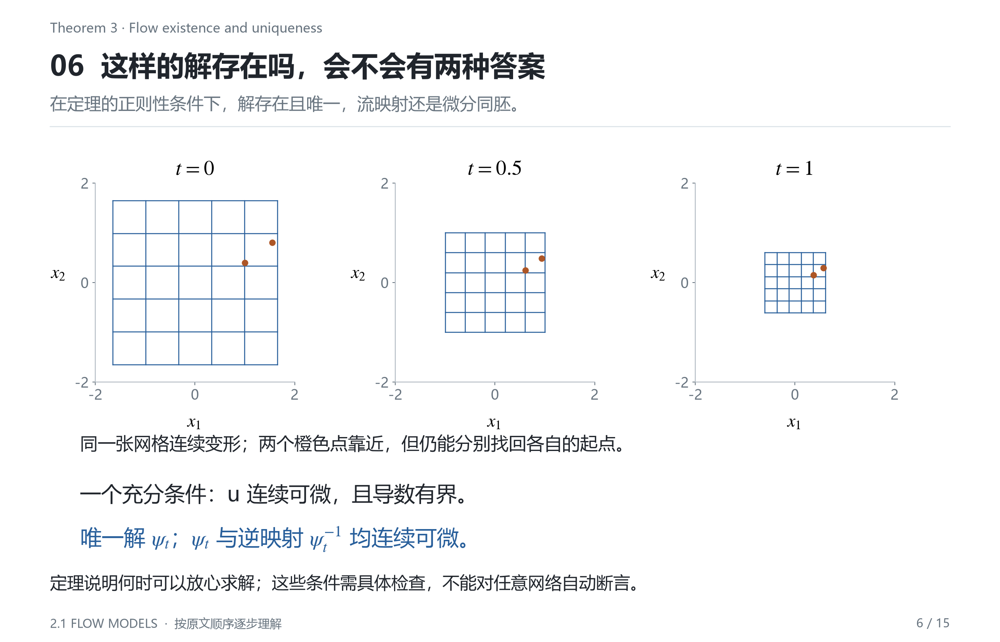

一个充分条件是：向量场 $u$ 连续可微，并且导数有界。在这些条件下，式 (2) 定义的流存在且唯一；每个固定时刻的 $\psi_t$ 都是微分同胚。

“存在”表示每个起点确实能沿规则走完整个时间区间；“唯一”表示固定规则和起点后，不会有两条不同轨迹都满足条件。这里的“导数有界”控制的是速度随输入变化的快慢，并不要求速度大小在整个空间中被同一个常数限制。例如 $u_t(x)=-x$ 的速度随 $|x|$ 增大，但它对位置的导数始终是 $-1$。

导数受到控制，能推出速度关于位置满足某个 Lipschitz 界：

$$
\|u_t(x)-u_t(y)\|\le L\|x-y\|.
$$

它表达了相近位置的速度不能毫无控制地相差很大。全局 Lipschitz 加适当的时间连续性足以保证这里的全局存在与唯一性；进一步的连续可微条件则用于保证流及其逆映射的光滑性。这些是充分条件，不满足某个条件并不能直接推出没有解。

微分同胚的意思是：$\psi_t$ 可逆，并且它与逆映射 $\psi_t^{-1}$ 都连续可微。图中的网格逐渐缩小，但仍然能追踪每个点来自哪里。更一般的流还可以使网格弯曲、拉伸或压缩。逆映射满足：

$$
\psi_t^{-1}\bigl(\psi_t(x_0)\bigr)=x_0.
$$

因此，不同初始点不会在同一时刻合并为同一个点。否则，那个点就无法唯一恢复自己的起点。这里必须保留“同一时刻”这个限定；不同轨迹在不同时间经过同一空间位置，并不违反唯一性。

这个定理适用于精确的连续运动。稍后用计算机离散近似时，还需要考虑数值误差。对于神经网络速度场，也应根据具体激活函数和结构检查条件，例如 ReLU 的折点就不满足连续可微，不能把所有网络一概视为满足上述全部假设。

定理给出了解存在且性质良好的条件，但没有直接给出解的公式。先用一个可以手算的例子，看清流究竟怎样求出来。

## Example 4 Linear Vector Fields 线性向量场

### 从速度场推导流的公式

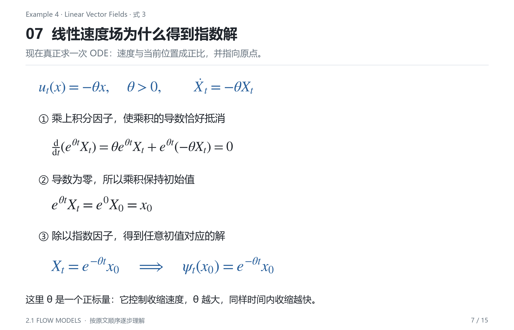

考虑：

$$
u_t(x)=-\theta x,\qquad\theta>0.
$$

这里 $\theta$ 是一个正的标量，决定收缩速度。因为当前位置与速度方向相反，点会向原点运动；$\theta$ 越大，同一位置上的速度绝对值越大。

我们要求解：

$$
\frac{\mathrm dX_t}{\mathrm dt}=-\theta X_t,
\qquad X_0=x_0.
$$

一个方便的做法是乘上积分因子 $e^{\theta t}$。这个因子的选择并非猜谜：它的导数带来 $+\theta$，恰好能抵消方程里的 $-\theta$。使用乘积求导法则：

$$
\begin{aligned}
\frac{\mathrm d}{\mathrm dt}\left(e^{\theta t}X_t\right)
&=\theta e^{\theta t}X_t
+e^{\theta t}\frac{\mathrm dX_t}{\mathrm dt}\\
&=\theta e^{\theta t}X_t
+e^{\theta t}(-\theta X_t)\\
&=0.
\end{aligned}
$$

导数为零，说明 $e^{\theta t}X_t$ 不随时间变化。它在 $t=0$ 的值是 $x_0$，所以在所有时刻都有：

$$
e^{\theta t}X_t=x_0.
$$

两边乘以 $e^{-\theta t}$，得到：

$$
\boxed{\psi_t(x_0)=e^{-\theta t}x_0.}
\tag{3}
$$

求出候选公式后，还应检验两个条件。首先检验初值：

$$
\psi_0(x_0)=e^0x_0=x_0.
$$

再固定 $x_0$，对时间求导，使用链式法则：

$$
\begin{aligned}
\frac{\partial}{\partial t}\psi_t(x_0)
&=\frac{\partial}{\partial t}\left(e^{-\theta t}x_0\right)\\
&=-\theta e^{-\theta t}x_0\\
&=-\theta\psi_t(x_0)\\
&=u_t\bigl(\psi_t(x_0)\bigr).
\end{aligned}
$$

初值和 ODE 都满足，式 (3) 才确实是所需的流。这个推导在 $d$ 维同样成立，因为标量 $e^{-\theta t}$ 会把每个坐标按同样的比例缩放。

### 用具体数值看懂指数收缩

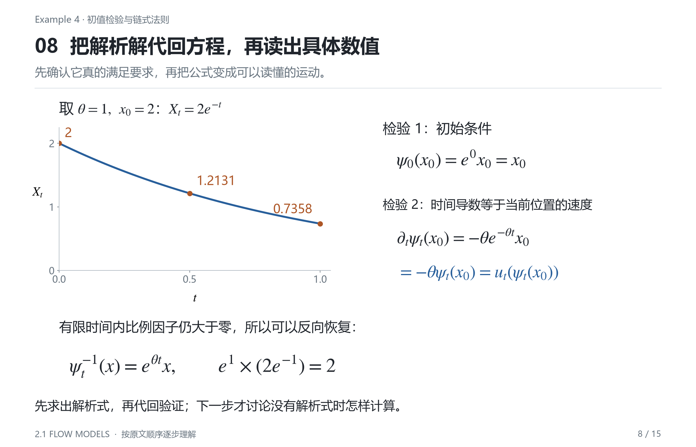

取 $\theta=1$、$x_0=2$：

$$
X_t=2e^{-t},\qquad u_t(X_t)=-2e^{-t}.
$$

| 时间 $t$ | 精确状态 $X_t$ | 该处速度 $u_t(X_t)$ |
| ---: | ---: | ---: |
| 0 | 2.000000 | −2.000000 |
| 0.25 | 1.557602 | −1.557602 |
| 0.50 | 1.213061 | −1.213061 |
| 0.75 | 0.944733 | −0.944733 |
| 1.00 | 0.735759 | −0.735759 |

先看状态列：数值一直减小。再看速度列：虽然速度始终为负，绝对值却逐渐减小。因此图中的曲线一开始下降较快，之后越来越平。这正好把 ODE 部分对曲线形状的判断落实成了精确结果。

这里 $u_t(x)=-x$ 和 $\psi_t(x_0)=e^{-t}x_0$ 已经明显不同：前者告诉我们现在的速度，后者告诉我们累计运动后的状态。

有限时间内 $e^{-t}>0$，所以收缩仍然可逆：

$$
x=\psi_t(x_0)=e^{-t}x_0
\quad\Longrightarrow\quad
\psi_t^{-1}(x)=e^tx.
$$

两个起点的距离变成原来的 $e^{-t}$ 倍，却不会在有限时刻变成零。所有点趋向原点是把时间继续延伸到 $t\to\infty$ 后的极限行为，不能理解为它们在 $t=1$ 已经合并。

这个例子之所以容易，是因为流有显式公式。一般向量场，尤其是复杂神经网络表示的向量场，通常没有这样的闭式解。下一步要解决的是：只知道当前位置的速度，计算机怎样一步步算出运动结果？

## Simulating an ODE 数值模拟常微分方程

### Euler method 用起点速度走一小步

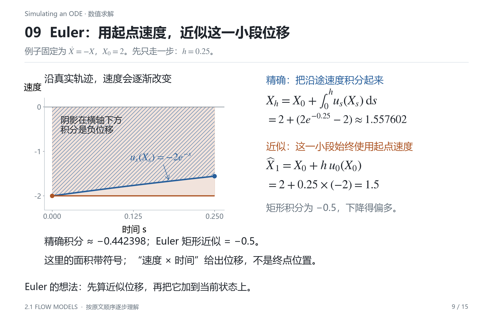

精确解在一小段时间内满足：

$$
X_{t+h}=X_t+\int_t^{t+h}u_s(X_s)\,\mathrm ds.
$$

积分把这段时间里不断变化的速度累加起来。Euler 方法的近似是：这一步先把速度视为起点速度，于是：

$$
\int_t^{t+h}u_s(X_s)\,\mathrm ds
\approx h\,u_t(X_t).
$$

令 $n$ 为总步数，$h=1/n$ 为步长，$t_k=kh$。用 $\widehat X_k$ 表示时刻 $t_k$ 的数值近似，区别于精确解 $X_{t_k}$，就得到式 (4) 对应的更新规则：

$$
\boxed{\widehat X_{k+1}
=\widehat X_k+h\,u_{t_k}(\widehat X_k).}
\tag{4}
$$

这里三项依次是：旧状态、时间步长、旧状态上的速度。最后两项相乘得到位移，再加到旧状态上。

继续取 $u_t(x)=-x$、$\widehat X_0=2$，并选择 $n=4$、$h=0.25$。第一步是：

$$
u_0(2)=-2,\qquad
\Delta x=0.25\times(-2)=-0.5,
$$

$$
\widehat X_1=2-0.5=1.5.
$$

精确结果却是 $X_{0.25}\approx1.557602$。原因可以直接从图上看出来：真实速度的绝对值逐渐减小，而 Euler 在这一小段里始终使用起点速度 $-2$，于是下降得多了一些。

### 连续执行四步

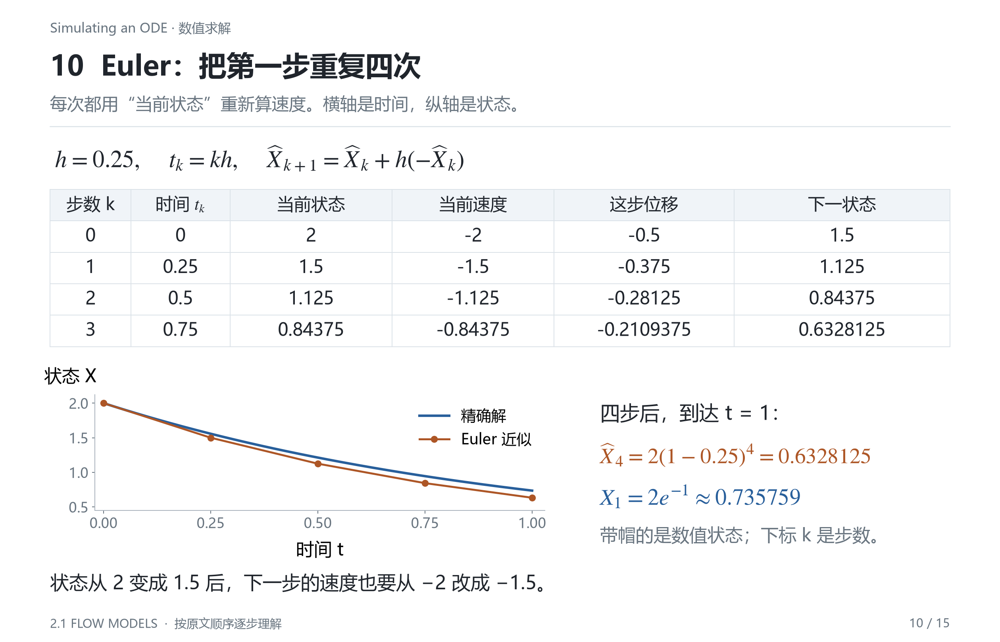

下一步必须使用已经算出的新状态 $1.5$。虽然知道精确解是 $1.557602$，实际算法并不会把它偷偷代入：一般问题中，我们根本不知道精确解。

| 步 $k$ | 时间 $t_k$ | 当前近似 $\widehat X_k$ | 当前速度 | 位移 $h u$ | 下一近似 $\widehat X_{k+1}$ |
| ---: | ---: | ---: | ---: | ---: | ---: |
| 0 | 0.00 | 2 | −2 | −0.5 | 1.5 |
| 1 | 0.25 | 1.5 | −1.5 | −0.375 | 1.125 |
| 2 | 0.50 | 1.125 | −1.125 | −0.28125 | 0.84375 |
| 3 | 0.75 | 0.84375 | −0.84375 | −0.2109375 | 0.6328125 |

每一行的最后一个数，成为下一行的当前状态。完成四行，时间从 $0$ 到达 $1$。对这个特定场，更新还能写成：

$$
\widehat X_{k+1}=(1-h)\widehat X_k,
\qquad
\widehat X_n=2(1-1/n)^n.
$$

因此四步结果是 $0.6328125$，而精确终点是 $2e^{-1}\approx0.735759$。它们的差异来自求解近似；这里并没有任何训练过程。

### Heun's method 先预测 再修正

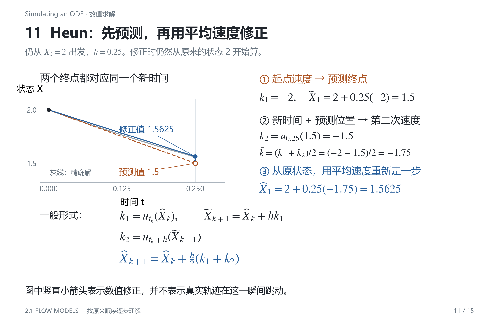

Euler 只使用起点的速度。Heun 再看一次预测终点的速度，用两者的平均值估计这段时间的运动。

首先，在当前状态计算速度：

$$
k_1=u_{t_k}(\widehat X_k).
$$

接着用 Euler 做一次预测：

$$
\widetilde X_{k+1}=\widehat X_k+h k_1.
$$

然后，把预测位置和新时间一起交给向量场：

$$
k_2=u_{t_k+h}(\widetilde X_{k+1}).
$$

最后，从原来的状态出发，使用平均速度：

$$
\boxed{\widehat X_{k+1}
=\widehat X_k+\frac h2(k_1+k_2).}
$$

这里 $k_1,k_2$ 是两次速度计算的名字；$\widetilde X_{k+1}$ 是临时预测值，最终保留下来的是修正后的 $\widehat X_{k+1}$。

把第一步完整算一遍：

$$
\begin{aligned}
k_1&=-2,\\
\widetilde X_1&=2+0.25(-2)=1.5,\\
k_2&=-1.5,\\
\frac{k_1+k_2}{2}&=-1.75,\\
\widehat X_1&=2+0.25(-1.75)=1.5625.
\end{aligned}
$$

修正时从 $2$ 出发，不能再从临时点 $1.5$ 出发加一遍平均位移，否则就重复走了一段。对一般随时间变化的场，第二次计算还必须使用 $t_k+h$，不能只换位置而保留旧时间。

与精确值 $1.557602$ 比较，这次结果更接近真实轨迹。直观原因是，平均速度注意到了这一步后半段下降速度已经减慢。不过预测点仍然只是近似，所以 Heun 也不是精确求解。

### 补充理解 步长 精度与计算量

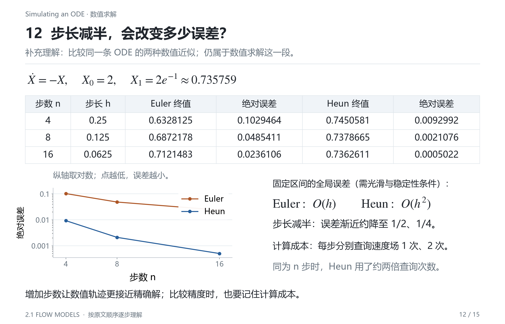

下面的比较用于理解数值近似，不需要把它当作新的模型定义。对同一个 $\dot X=-X$、$X_0=2$，仍然计算到 $t=1$：

| 总步数 $n$ | Euler 终点 | Heun 终点 | Euler 绝对误差 | Heun 绝对误差 |
| ---: | ---: | ---: | ---: | ---: |
| 4 | 0.6328125 | 0.7450581 | 0.1029464 | 0.0092992 |
| 8 | 0.6872178 | 0.7378665 | 0.0485411 | 0.0021076 |
| 16 | 0.7121483 | 0.7362611 | 0.0236106 | 0.0005022 |

步数增加，步长减小，每一步里速度变化较少，近似通常会改善。在足够光滑和适当稳定性条件下，固定时间区间上的全局误差：Euler 为 $O(h)$，Heun 为 $O(h^2)$。这些阶数描述步长足够小时的误差规律，并不保证所有方程和所有步长下都按精确比例改善。

Euler 每步查询一次速度场，Heun 每步查询两次。因此四步 Euler 用四次查询，四步 Heun 用八次；相同步数并不等于相同计算量。将来速度场由大型神经网络实现时，每一次查询都有实际成本。

还要区分精确流与数值更新的性质。例如对 $u=-x$，若 Euler 取 $h=1$，一步就把任意 $x$ 更新成 $x-x=0$；精确流在同一时间却是 $e^{-1}x$，仍然可逆。数值步长选择不当，会破坏连续运动原本具有的性质。

目前，我们已经知道怎样定义一个运动规则、确认它的解，并近似计算运动结果。现在才把它变成生成模型。

## Flow models 流模型

### 用神经网络表示向量场

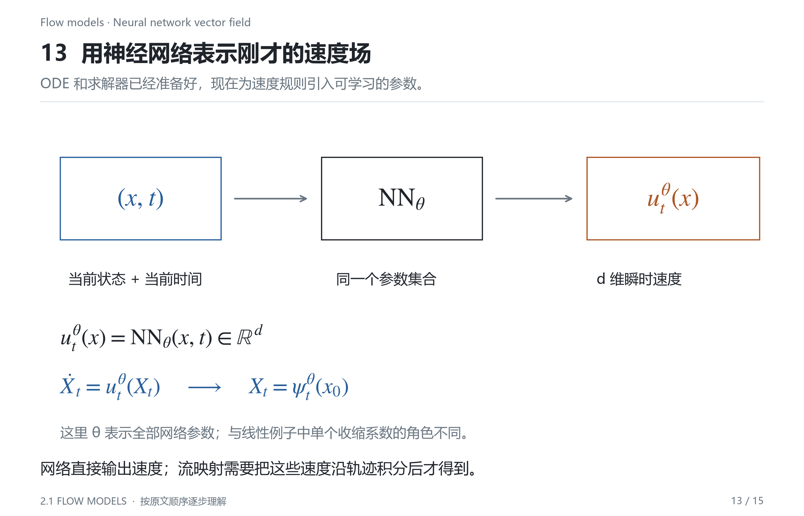

手写 $u_t(x)=-x$ 只能得到一种简单收缩。为了表示更丰富的运动，用带参数的神经网络输出速度：

$$
u_t^\theta(x)=\operatorname{NN}_\theta(x,t).
$$

输入是 $d$ 维状态 $x$ 和一个时间 $t$，输出是 $d$ 维速度。比如状态含两个像素值，网络就输出这两个值各自应该怎样变化；对于高维样本，输出维数同样与状态维数匹配。

这里的 $\theta$ 表示全部网络参数，通常包含很多权重和偏置。它与线性例子里控制收缩快慢的单个正数 $\theta$ 用了同一个字母，但含义不同；“参数”这个共同概念把两种写法联系起来。

$u_t^\theta$ 的上标 $\theta$ 是参数标记，不表示乘方；下标 $t$ 标记当前时间。参数决定整个运动规则，时间和状态决定这一次查询应该输出哪个速度。把这三个角色分开，就能看懂后面的采样循环。

网络直接给出的是：

$$
\underbrace{u_t^\theta(x)}_{\text{此刻的速度}},
$$

求解由它定义的 ODE，才能得到：

$$
\underbrace{\psi_t^\theta(x_0)}_{\text{从起点累计运动到的状态}}.
$$

因此，调用一次网络通常不会直接得到最终样本。采样时要反复把更新后的状态和时间输入同一个网络。这个过程改变的是状态，参数 $\theta$ 保持固定；更新参数属于训练，沿 ODE 更新状态属于生成。

### 随机初值与终点分布

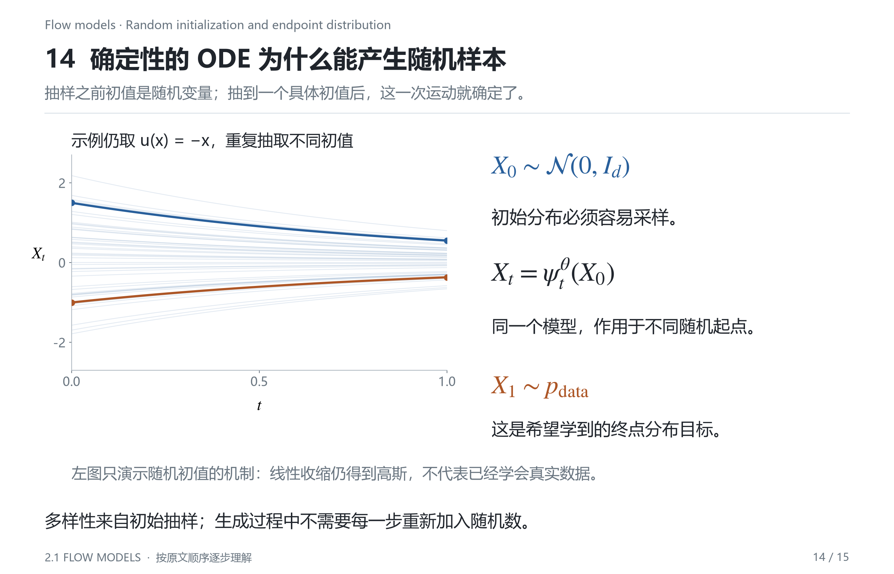

到目前为止，给定一个起点和一个速度场，结果完全确定。但生成模型需要能够产生不同样本。随机性可以放在运动开始之前：每次生成时，先抽取一个随机初值。

$$
X_0\sim p_{\mathrm{init}}.
$$

符号 $\sim$ 表示“服从某个分布”。常用选择是标准高斯：

$$
p_{\mathrm{init}}=\mathcal N(0,I_d).
$$

$0$ 是均值向量，$I_d$ 是单位协方差矩阵。选择初始分布的关键是可以方便地采样；每次重新抽样，通常就会得到不同初始向量。

完整模型写成：

$$
\boxed{X_0\sim p_{\mathrm{init}},\qquad
\frac{\mathrm dX_t}{\mathrm dt}=u_t^\theta(X_t).}
$$

大写 $X_t$ 现在也表示随机变量：在尚未指定初始抽样结果时，它的值不确定；一旦固定抽到的 $X_0=x_0$，后续轨迹就由 ODE 确定。重复使用同一初值和同一确定性求解过程，会得到相同结果。

看图中的多条轨迹：每条轨迹的起点不同，随后共同遵守同一个速度场。在这里讨论的采样算法中，每个样本只在开始时抽一次初值，不在每一步重新抽取状态。

仍用线性收缩解释这个机制。若分别抽到 $-2,-1,0,1,2$，在 $t=1$ 时，它们分别变为约 $-0.736,-0.368,0,0.368,0.736$。这个算例只说明“随机起点经过确定变换仍产生不同结果”，没有声称简单收缩已经学会真实图片。

生成建模的目标进一步要求：

$$
\boxed{X_1\sim p_{\mathrm{data}}
\quad\Longleftrightarrow\quad
\psi_1^\theta(X_0)\sim p_{\mathrm{data}}.}
$$

这是理想目标；实际训练希望终点分布尽可能接近数据分布。它约束的是大量终点样本共同呈现的统计规律，单独看一个终点无法判断整个分布是否正确。

如何学出这样的参数，属于之后的训练问题。这一节先把模型定义清楚：从哪里开始、怎样运动，以及希望最终得到什么分布。

## Algorithm 1 Sampling from a Flow Model with Euler method 用 Euler 从流模型采样

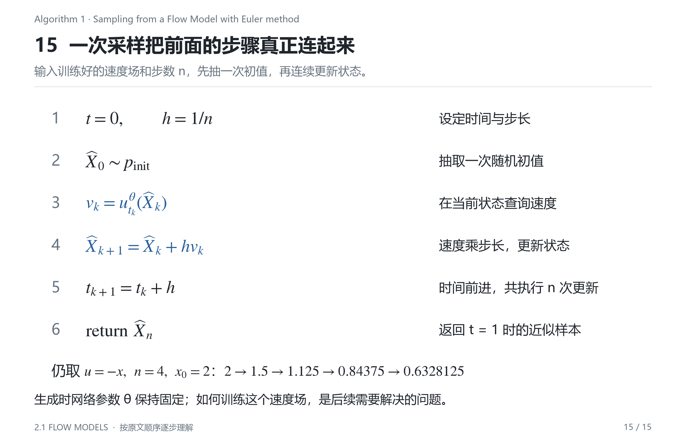

算法的输入是已经给定的神经网络速度场 $u_t^\theta$ 和总步数 $n$。它不在采样过程中训练网络，而是使用当前参数生成一个样本。

| 原算法步骤 | 执行的操作 | 具体含义 |
| --- | --- | --- |
| 1 | 设 $t=0$ | 从时间区间起点开始 |
| 2 | 设 $h=1/n$ | 将长度为 $1$ 的区间分成 $n$ 步 |
| 3 | 抽取 $X_0\sim p_{\mathrm{init}}$ | 本次生成的初始状态 |
| 4 | 循环 $i=1,\ldots,n$ | 重复执行下面两项 |
| 5 | 更新 $x\leftarrow x+h u_t^\theta(x)$ | 根据当前速度移动一步 |
| 6 | 更新 $t\leftarrow t+h$ | 状态与时间同步向前 |
| 7 | 结束循环 | 完成全部 $n$ 次更新 |
| 8 | 返回最后状态 | 得到 $t=1$ 的近似样本 |

伪代码可以写成：

```python
# model(x, t) 输出速度；生成期间模型参数固定
t = 0.0
h = 1.0 / n_steps
x = sample_initial_distribution()

for i in range(n_steps):
    velocity = model(x, t)
    x = x + h * velocity
    t = t + h

return x
```

如果输入的速度场恰好是 $u_t(x)=-x$，并以某次给定初值 $x_0=2$ 演示计算，取四步就重新得到：

$$
2\longrightarrow1.5\longrightarrow1.125
\longrightarrow0.84375\longrightarrow0.6328125.
$$

这串数只是算法执行示例；对连续分布而言，实际抽样不要求恰好抽到某个指定数。每次生成换一个初值，就重新执行同样的循环。

算法最后返回的应理解为 $\widehat X_n\approx X_1$。原算法使用 $X_1$ 标记最终状态，而加帽记号专门提醒我们：有限步 Euler 得到的是精确终点的近似。

因此，有两个不同层面的改进问题。增加步数或更换求解器，主要减少“有没有准确跟随现有速度场”的数值误差；训练更好的网络，才是在改善“这个速度场能否产生合适数据分布”的模型误差。两者不应混为一谈。

这一节建立了从轨迹定义到采样算法的完整过程。后续训练方法需要回答的具体问题是：只有真实数据样本时，怎样为不同时间和位置提供合适的速度学习信号？

需要文字解释时，可以阅读[Flow Models 学习笔记](02-01-flow-models.md)。
